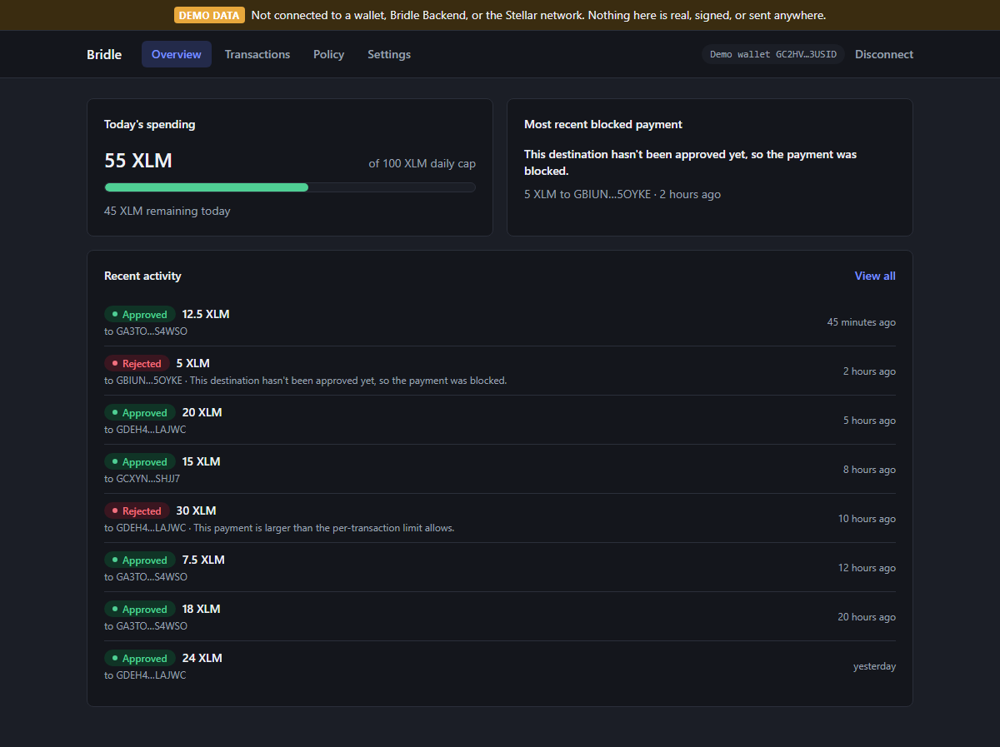
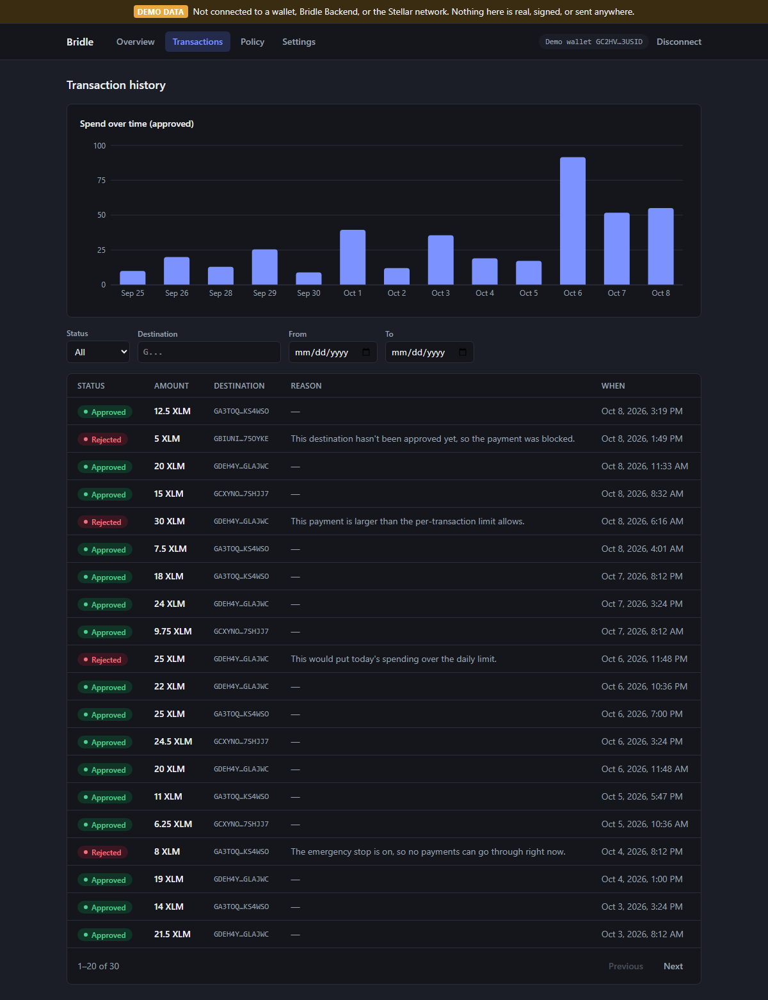
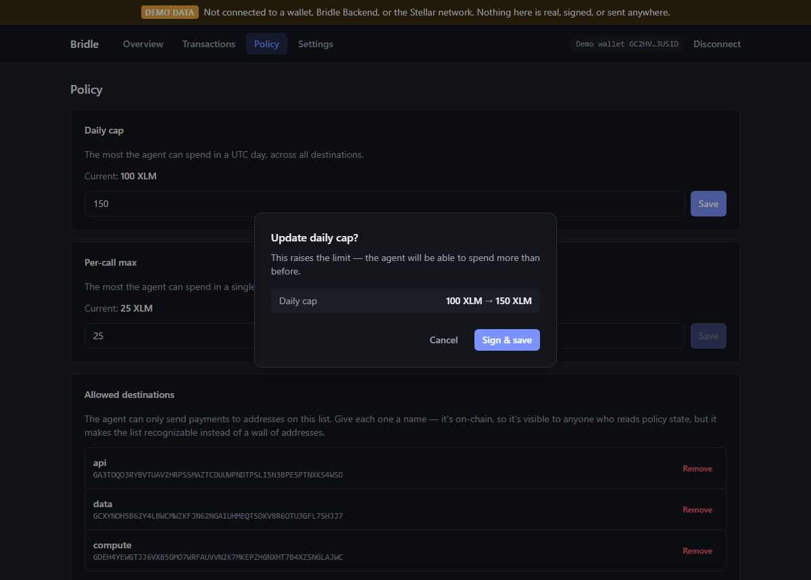
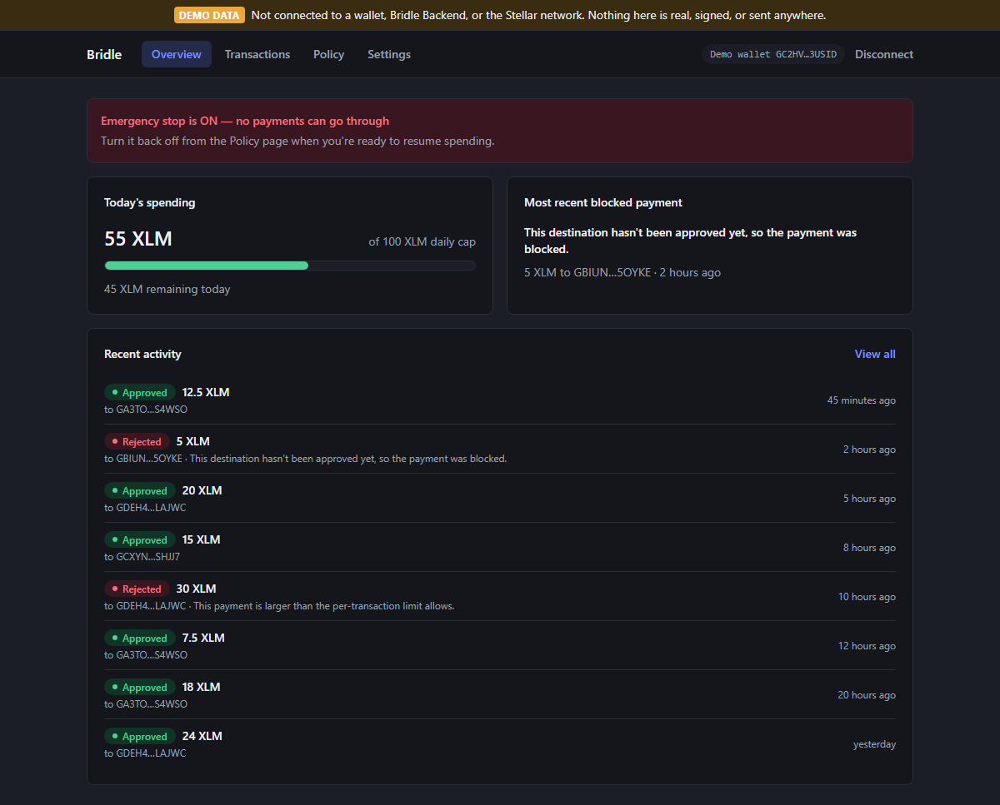

# Bridle Frontend

[](https://github.com/Bridle-Stellar/Bridle-Frontend/actions/workflows/ci.yml)
[](LICENSE)

**Live demo:** https://bridle-stellar.github.io/Bridle-Frontend/ (sample
data only; no wallet or backend is connected. See [Demo mode](#demo-mode).)

The human-facing dashboard for **Bridle**: parental controls for an
autonomous AI agent's crypto wallet on Stellar. This is the only one of
Bridle's three repos a human looks at directly — it shows what an agent
has spent, what it's allowed to spend, and lets the owner change those
limits, signing every change with their own wallet.

It talks to **Bridle Backend** for all reads (transaction history,
spend summary, stats) and for building unsigned policy-change
transactions; it never calls Soroban RPC directly except to submit a
transaction Bridle Backend already built and the owner has just signed
with Freighter.

## Screens

- **Connect** — Freighter wallet connect. First-time owners land in a
  short guided setup (daily cap, per-call max, one approved destination,
  emergency-stop state) instead of a blank dashboard.
- **Overview** — the three things an owner checks first: how much has
  been spent today vs. the daily cap, whether the emergency stop is on or
  a payment was just blocked, and a compact recent-activity feed.
- **Transactions** — the full paginated history with filters (status,
  destination, date range), a spend-over-time chart, and rejection
  reasons written in plain language.
- **Policy** — edit the daily cap, per-call max, and the destination
  allowlist, and toggle the emergency stop. Every change shows old → new
  before it asks for a signature.
- **Settings** — registered agent address(es), session (disconnect),
  and network info.

## Screenshots

Captured from the demo build with `npm run screenshots`. **All screenshots
show demo data**, not a real wallet or backend.

| Overview (demo data) | Transactions (demo data) |
| --- | --- |
|  |  |
| **Policy: old → new confirm step (demo data)** | **Emergency stop on (demo data)** |
|  |  |

## Setup

Requires Node.js 22.12 or newer.

```bash
npm install
cp .env.example .env
# edit .env — see below
npm run dev
```

### Pointing at Bridle Backend

Set `VITE_BRIDLE_API_URL` in `.env` to a running Bridle Backend instance
(defaults to `http://localhost:8000`). See that repo's README for how to
run it locally. `VITE_SOROBAN_RPC_URL` and `VITE_STELLAR_NETWORK_PASSPHRASE`
must match Bridle Backend's `SOROBAN_RPC_URL` / `NETWORK_PASSPHRASE` — a
mismatch shows a "wrong network" warning instead of silently signing a
transaction for the wrong chain.

### Demo mode

```bash
npm run dev:demo     # dev server with sample data
npm run build:demo   # what the live demo deploys
```

Demo mode is a build-time flag (`VITE_DEMO_MODE=true`, set by
`.env.demo`). It replaces Bridle Backend with an in-memory mock
(`src/demo/mockBackend.ts`), "connects" a made-up address instead of
Freighter, and applies policy changes to the mock instead of signing or
submitting anything. Every screen shows a permanent **Demo data** banner,
and normal builds don't include the demo code at all.

One difference from a real setup: the demo answers `GET /policy` with a
sample policy so the Policy screen can be shown. Real Bridle Backend
doesn't have that endpoint yet (see [Known gaps](#known-gaps)).

The `Deploy demo` workflow publishes `main` to GitHub Pages.

### Wallet requirements

- The [Freighter](https://www.freighter.app/) browser extension, installed
  and unlocked.
- Freighter's selected network must match `VITE_STELLAR_NETWORK_PASSPHRASE`
  above (testnet by default).
- The connected account must be the policy's **owner** to make policy
  changes — Policy and Settings pages will build valid transactions for
  any connected address, but the contract itself rejects owner-only calls
  from anyone else at submission time.

## Known gaps

This frontend was built by reading Bridle Backend's README and code
directly (per the project brief: don't guess at the chain-interaction
pattern, confirm it), and its API types were re-checked field-for-field
against that repo's finalized README once Bridle Contract's own interface
was confirmed. One real gap remains even in that final version:

**No `GET /policy` endpoint.** Bridle Backend exposes `/policy/*` as a
write-only proxy (POST an intended change, get back unsigned XDR) and
`/transactions/summary` for the daily cap/spent/remaining numbers, but
nothing returns the *current* full policy snapshot — per-call max, the
allowlist, registered agents, or whether the emergency stop is on.
Internally its `SorobanContractClient` already computes all of this for
its own local pre-check; it's just never serialized through a router.

This frontend handles it as follows (see `src/api/types.ts` and
`src/api/policy.ts` for the full reasoning):

- `getPolicyState()` calls `GET /policy` and treats a 404 as "not
  implemented yet" (`{ available: false }`), not an error.
- Anywhere that needs it — the emergency-stop banner on Overview, the
  Policy and Settings pages — checks `available` and renders an explicit
  **"Can't confirm current policy details"** notice instead of guessing a
  default. This matters most for the kill switch: showing "off" when the
  real state is unknown would be actively unsafe, so the app says it
  doesn't know instead.
- A genuine network/server failure (backend unreachable) is **not**
  swallowed the same way — it surfaces as the normal "can't reach Bridle
  right now" error state, so "down" is never confused with "not
  implemented."

**Fixing this properly is a small Bridle Backend change**, not a frontend
workaround: one router function that serializes `PolicySnapshot` +
`SpendStatus` (already computed for the local pre-check) as JSON. Once
that endpoint exists, remove the `available` branching in
`src/api/policy.ts` and the types stop being a documented assumption.

## Units and amounts

Every amount from Bridle Backend is an integer in the token's smallest
unit (e.g. stroops for native XLM), never a display decimal. All
conversion goes through `src/lib/decimal.ts` (backed by `decimal.js`) —
nowhere else in the app does `amount / 1e7` or similar. Every rendered
amount includes its token symbol (`src/components/common/MoneyAmount.tsx`)
— there's no code path that prints a bare number for money.

## Testing

```bash
npm run lint      # oxlint
npm run typecheck # tsc
npm test          # component/unit tests (Vitest + Testing Library)
npm run test:e2e  # Playwright smoke test, mocked backend + wallet
```

- `src/lib/decimal.test.ts` — smallest-unit ↔ display conversion,
  precision, validation.
- `src/lib/rejectionReasons.test.ts` — every backend rejection code maps
  to a plain-language sentence, and an unmapped code falls back safely.
- `src/lib/stellarAddress.test.ts` — Stellar address validation.
- `src/components/policy/*.test.tsx` — the policy forms: invalid/negative
  amounts and malformed addresses are rejected before a signature is ever
  requested.
- `src/demo/mockBackend.test.ts` — the demo mock's responses, and that
  demo mode is off in normal builds.
- `e2e/demo.spec.ts` — the demo build shows the "Demo data" banner on
  every screen and never calls a backend.
- `e2e/overview.spec.ts` — connect wallet → view overview → view
  transaction history, against a mocked Bridle Backend (via Playwright's
  `page.route`) and a mocked Freighter (via a test-only seam in
  `src/lib/freighter.ts` — inert in real builds; a real extension can't
  run in a headless test browser).

## Project structure

```
src/
  api/          Typed request/response models + fetch clients (mirrors Bridle Backend's schemas)
  lib/          Decimal/unit math, Freighter wrapper, tx submission, address validation, rejection-reason copy
  context/      Wallet connection state
  hooks/        React Query hooks + policy-write mutations
  components/   Presentational components, grouped by screen (common/ is shared)
  pages/        Screen-level components wired to hooks
  demo/         Demo-mode flag and in-memory mock backend (demo builds only)
e2e/            Playwright tests
scripts/        Screenshot capture for the README
```

## License

[MIT](LICENSE)
